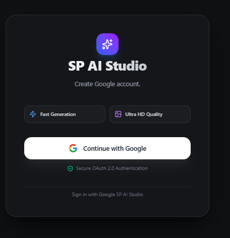
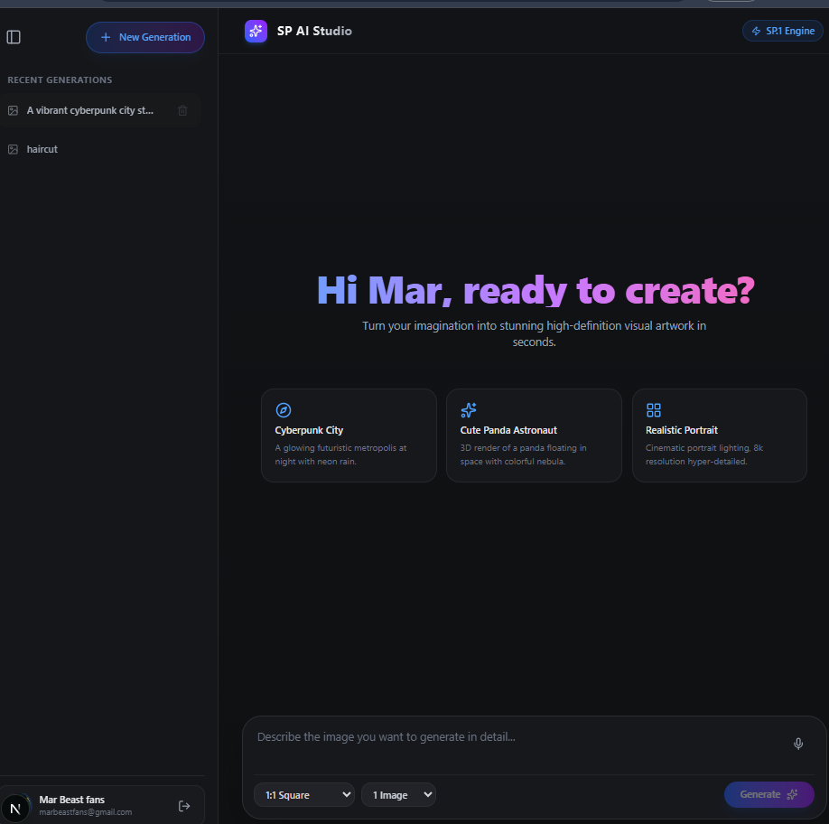

<div align="center">

# ✨ AI Content & Media Generator Pro

**A full-stack AI-powered media suite built with Next.js, Hugging Face Inference API, and modern web tools.**


</div>

A full-stack AI-powered media generation platform built with **Next.js, Hugging Face Inference API, Pollinations AI, and modern web technologies**.

---

## 🚀 About The Project

**AI Content & Media Generator Pro** is a modern AI-powered platform designed for generating and interacting with AI media.

The application integrates **Hugging Face Inference API** and **Pollinations AI** to provide AI-powered image generation, video generation, and conversational AI features.

Built with **Next.js App Router**, the application includes secure authentication using **NextAuth.js**, a responsive modern interface, and an interactive AI studio.

---

## 📸 Screenshots



### 🔐 Authentication & Login

Secure user authentication powered by **NextAuth.js**.

### 💬 AI Dashboard & Interactive Studio


The main workspace for AI media generation, prompt customization, AI chat, and real-time previews.

---

## ✨ Key Features

* 🤗 **Hugging Face AI Models**

  * Stable Diffusion
  * FLUX
  * CogVideoX
  * AI inference models

* 🎨 **AI Image Generation**

  * Generate images from text prompts
  * High-quality AI-generated visuals
  * Prompt customization

* 🎬 **AI Video Generation**

  * AI-powered video generation
  * Real-time generation and preview

* 💬 **AI Chat**

  * Interactive AI conversations
  * AI-powered responses

* ⚡ **Real-Time Generation**

  * Fast API requests
  * Buffer conversion
  * Real-time media previews

* 🔒 **Secure Authentication**

  * NextAuth.js
  * Protected routes
  * Secure sessions

* 🎨 **Modern UI/UX**

  * Tailwind CSS
  * Framer Motion animations
  * Responsive interface
  * Modern dashboard design

* 📱 **Fully Responsive**

  * Desktop
  * Tablet
  * Mobile

---

## 🛠️ Tech Stack

### Frontend & UI

* **Next.js** — App Router
* **React**
* **TypeScript / JavaScript**
* **Tailwind CSS**
* **React Icons**
* **Framer Motion**

### Backend & AI

* **Hugging Face Inference API**
* **Pollinations AI**
* **Next.js API Routes**
* **Node.js**
* **NextAuth.js**

### Authentication

* **NextAuth.js**
* Google OAuth
* Secure session management
* Protected routes

---

## 📦 Installation

### 1. Clone the Repository

```bash
git clone https://github.com/marcossbc/ai-image-generato.git
```

### 2. Navigate to the Project

```bash
cd ai-image-generato
```

### 3. Install Dependencies

```bash
npm install
```

### 4. Create Environment Variables

Create a `.env.local` file in the root directory:

```env
# Hugging Face Access Token
HUGGINGFACE_TOKEN=hf_your_token_here

# NextAuth Configuration
NEXTAUTH_SECRET=your_nextauth_secret_key
NEXTAUTH_URL=http://localhost:3000

# Google OAuth
GOOGLE_CLIENT_ID=your_google_client_id
GOOGLE_CLIENT_SECRET=your_google_client_secret
```

> ⚠️ Never upload `.env.local` or your API keys to GitHub.

---

## ▶️ Run the Development Server

```bash
npm run dev
```

Open your browser and visit:

```text
http://localhost:3000
```

---

## 🔐 Google OAuth Setup

To enable Google authentication:

1. Create a project in Google Cloud Console.
2. Create an OAuth Client ID.
3. Select **Web Application**.
4. Add the following authorized redirect URI:


5. Add your Google credentials to `.env.local`.

---

## 🤗 Hugging Face Setup

Create a Hugging Face access token and add it to:

```env
HUGGINGFACE_TOKEN=hf_your_token_here
```

Make sure the token is kept private and is only used on the server side.

---

## 📁 Project Structure

```text
AI-Content-Media-Generator/
│
├── app/
│   ├── api/
│   ├── dashboard/
│   ├── login/
│   └── ...
│
├── components/
│   ├── ui/
│   ├── dashboard/
│   └── ...
│
├── lib/
│   ├── auth/
│   └── ...
│
├── public/
│
├── .env.local
├── .gitignore
├── package.json
├── next.config.ts
├── tailwind.config.ts
└── README.md
```

---

## 🎯 Future Improvements

* 🖼️ AI image gallery
* 📥 Download generated media
* ❤️ Favorite generations
* 🕘 Generation history
* 👤 User profiles
* 💾 Database storage
* 🎨 Advanced prompt builder
* 🎬 Improved AI video generation
* 💳 Subscription system
* 📊 Usage analytics
* Inshalah🙄
---

## 📜 License

This project is distributed under the **MIT License**.

---

## ⭐ Support

If you find this project useful, consider giving it a ⭐ on GitHub.
